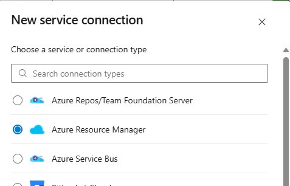

# Create the Service Connections
This may need system administrators as some information may need to come from Azure, etc.

1. Open Project Settings
Locate Service connections under Pipelines, Click on **New service connection**

   

2. Select Azure Resource Manager

   

3. Steps will vary based on whether a Service Connection or Managed
Identity is used.

4. Ensure that the Service Connection is verified / working and Save it.

   

Repeat the process for the Production environment.

# Build the pipeline files within the repository

## Collect the pipeline files from the repo.

**Mandatory:**

Copy the entire Dependencies folder into your repository, leaving
Dependencies at the root level. This folder contains the Pipeline files
as well as the pipeline configuration files and the Databricks v.268 CLI
which is needed for Databricks deployments.

**Optional:**

Copy Databricks_bundle to the repository for testing. These files
demonstrate a Databricks bundle which may be deployed.

## Configure the pipeline for your environment
1. Update the Dev.variables.yml file

   Open the Dev.variables.yml file and update the host to point to the host
in the Dev environment.

   Update the subscription to use the name of the service connection for
the Dev environment.

   

2. Update the Prod.variables.yml file

   Open the Prod.variables.yml file and update the host to point to the
host in the Prod environment.

   Update the subscription to use the name of the service connection for
the Prod environment.
   

# Set up the Environments
## Create the Environments

1. Within Azure Devops, open Pipelines and click on **Environments**.

   

2. Click **New environment**.

   

3. Enter **Dev** as the Name, click **Create**

   

4. Click **New environment**.

5. Enter **Prod** as the Name, click **Create**

## Add Approval Check to Prod

1. Click on the Prod environment

   

2. Click on **Approvals and checks** and then click the **+** button

   

3. Click **Approvals**

4. Add the approvers group OR add a list of approvers users to Approvers

   

5. Click **Create**

# Create the CI/CD Pipeline

1. Click New Pipeline

   

2. Click **Azure Repos Git**

   

3. Select the Repo

   

4. Click **Existing Azure Pipelines YAML file**

   

5. Select **/Dependencies/Pipeline/azure-pipeline.yml**

   

6. At the next screen, select **Save**

   

7. Click the ellipse on the right side and then **Rename/move**

   

8. Change the name to "Databricks CI/CD Pipeline" and click **Save**

# Test the pipeline

   Click into the pipeline and then click Run pipeline

   

   Observe the results and ensure that the pipeline completed successfully. There are 3 stages, a package and two deploy steps. The packaging should always succeed. If there are issues in the deployment, review the log and identify why the run failed.